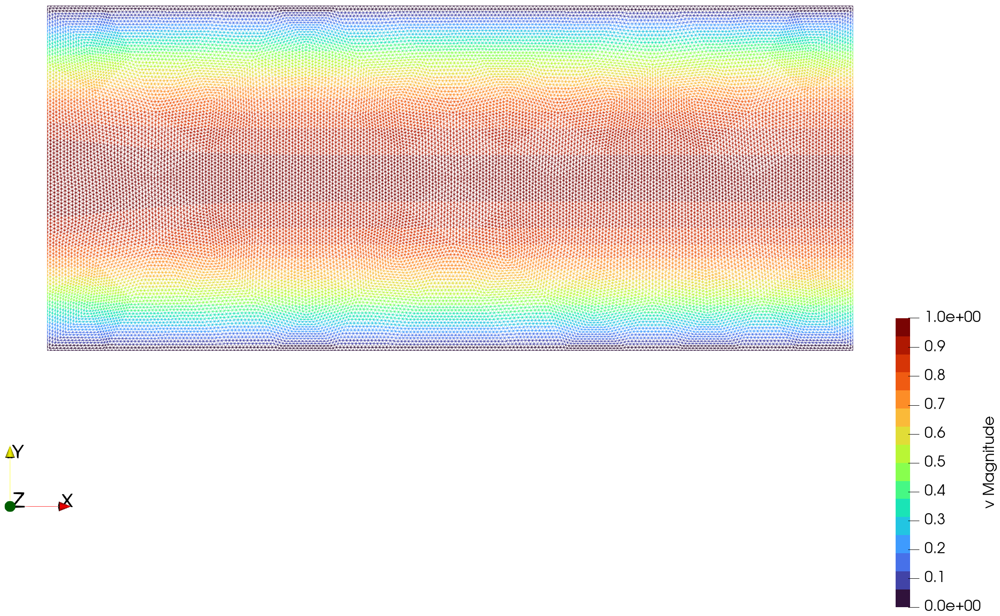

# Examples

```@contents
Pages = ["examples.md"]
Depth = 3
```

## Problem Setting


*Sketch of a computational domain.*

Within this package we consider problems for the Stokes equation with no-slip wall conditions,
a prescribed inlet velocity and do-nothing outlet(s).
For a generic domain as sketched above, we can (assuming enough regularity) mathematically
write the strong for of the problem as

```math
\begin{array}{rl}
    -\Delta v + \nabla p = 0  & \text{in } \Omega,\\
    \nabla \cdot v = 0  & \text{in } \Omega,\\
    v = v_{\infty}  & \text{on } \Gamma_{\text{in}},\\
    v = 0 & \text{on } \Gamma_{\text{wall}} \cup \Gamma_{\text{obs}}.
\end{array}
```

In the setting of finite elements, we would like to consider weak solutions to the problem,
which reads
```math
\begin{aligned}
    \int_\Omega \nabla v \cdot \nabla \phi \mathrm{ d}x - \int_\Omega p(\nabla \cdot \phi) \mathrm{ d}x = 0 
        &\qquad\forall \phi \in \mathbb{V},\\
    \int_\Omega (\nabla \cdot v) \psi \mathrm{ d}x = 0 
        &\qquad\forall \psi \in \mathbb{P},\\
\end{aligned}
```
where ``\mathbb{V} = H^{1}_0(\Omega,\mathbb{R}^d)``
and ``\mathbb{P} = \{p \in L^2(\Omega): \int_\Omega p(x) \mathrm{ d}x = 0\}``
denote the velocity and pressure space respectively.

The discretized system becomes then a symmetric saddle point system,
where ``L`` is the classical discretization of a vector-valued Laplace operator,
``B`` a type of gradient operator and then its transpose ``B^\intercal`` corresponding
to a divergence operator on the relevant discretized spaces. 
```math
\begin{aligned}
    S = \begin{pmatrix}
        L & B\\
        B^{\intercal} & -\alpha C
    \end{pmatrix}
\end{aligned}
```

MinFEM only uses first-order finite elements, which are known for saddle point problems to not
fulfill the inf-sup-condition and are thus not naturally pressure stable.
A common technique to circumvent this issue would be to use second-order finite elements for the velocity.
The combination is then called Taylor-Hood elements and archive stability.
Unfortunately, we are not able to do this with MinFEM.
However, there are also stabilization techniques for-first order elements available.
We will use a version of [1] corresponding to a scaled negative Laplacian.
In particular, ``C`` is a discretization of the Laplacian,
where the nodal contributions of each element ``T_k`` are scaled
by ``\frac{\operatorname{vol}(T_k)}{\sqrt{d}}`` and is thus mesh dependent.      
Further, we usually just fix ``\alpha = 0.05`` as reasonable.

[1] T. J. Hughes, L. P. Franca, and M. Balestra.
*A new finite element formulation for computational fluid dynamics: V. Circumventing the babuška-brezzi condition: a stable Petrov-Galerkin formulation of the stokes problem accommodating equal-order interpolations*. 
In: Computer Methods in Applied Mechanics and Engineering 59.1 (1986), pp. 85–99.
doi: [10.1016/0045-7825(86)90025-3](https://doi.org/10.1016/0045-7825(86)90025-3).

## 2D Computations

We can now take a look at some example computations.
The corresponding scripts can all be found in the `examples/` directory of the GitHub repository
and are all relatively similar.
Thus, we will go through the code for the first example and later show only the visualizations with Paraview.

### Channel
As a basic test case, we would like to consider the flow through a straight channel described by the following domain:
```math
\begin{aligned}
    \Omega &= (-7,7) \times (-3,3),\\
    \Gamma_{\text{in}} &= \{-7\} \times (-3,3),\\
    \Gamma_{\text{wall}} &=  (-7,7) \times \{-3, 3\}.
\end{aligned}
```

We have an inflow on the left side, that is described by
```math
\bar{v} = \begin{pmatrix}
    \cos\left(\frac{\pi}{6}|x_2|\right)\\
    0
\end{pmatrix}.
```

In the code, we first have to load the package and `MinFEM` as the base to handle the domain configuration.
```julia
using MinFEM, MinFEMFlow
```

Then we can load the given mesh of the domain and specify the boundary regions.
Import a mesh created via `gmsh` and specify boundary regions by the following commands.
Note that in these examples, the `4` in the mesh name refers to the number of refinements by splitting performed during the mesh creation in `gmsh`.
There are also other meshes and refinement levels available in the `meshes/` directory. 
```julia
mesh::Mesh = import_mesh("meshes/channel-4.msh");
noslip_boundary = select_boundaries(mesh, 1001, 1003)
inflow_boundary = select_boundaries(mesh, 1004)
```

The inflow function is set up by
```julia
inflow(x) = [cos(pi*abs(x[2])/6), 0.0]
```

With this information, we can create a `FlowSolver` object that contains the solution function for the Stokes flow.
```julia
flow = StokesFlowSolver(mesh, inflow_boundary, noslip_boundary, inflow)
```

It remains to actually solve the flow, which will store the solution vector and the computation time in the `FlowSolver` object.
One can then export the solution as a `.vtu` and visualize it with, e.g., Paraview.
```julia
solve!(flow)
write_to_vtk(flow, "results/channel")
```

Note that we assume the directory `results/` to exists.
Otherwise, the write command will throw an error.
If you want to check during runtime if the directory exists and create it if not,
you could add `mkpath("results")` before. 

Below, you can see an exemplary visualization using the wireframe of the mesh for the velocity
and a surface representation for the corresponding pressure.




### Cylindrical Obstacle

We can make the previous example slightly more interesting by adding an obstacle to the channel.
This is something that is commonly used for test cases in flow solvers and shape optimization routines.
The domain is then described as
```math
\begin{aligned}
    \Omega &= [(-7,7) \times (-3,3)] \setminus \{x \in \mathbb{R}^2: \Vert x \Vert_2 \leq 0.5\}, \\
    \Gamma_{\text{in}} &= \{-7\} \times (-3,3), \\
    \Gamma_{\text{wall}} &=  (-7,7) \times \{-3, 3\},\\
    \Gamma_{\text{obs}} &= \{x \in \mathbb{R}^2: \Vert x \Vert_2 = 0.5\}.
\end{aligned}
```

The inflow remains unchanged, and the only difference in the code is
that the new boundary of the obstacle `1005` has to be added to the no-slip boundary.

A visualization could then look like the following.
We observe that the maximal magnitude is now larger than 1,
which would correspond to the maximum of the inflow, as in the previous example.
This is a consequence of the overall narrower channel next to the obstacle.
Figuratively speaking, this is what we expect.
Since the same amount of fluid has to be transported through a smaller area,
it has to flow faster. 


### L Channel

Now, we can start with some just visual examples of various channel flows with slightly more complicated geometry.
A mathematical description of the boundaries is not very useful here,
if you are interested in the coordinates for specifying the inflow function or physical boundary IDs,
you can open the mesh or the corresponding `.geo`-file in `gmsh`.
Activate the labels via `Tools -> Options -> Geometry -> Visibility`
and make the coordinate grid visible via `Tools -> Options -> General -> Axes`.

Here, the long sides of the channel are the no-slip boundaries and the inflow is prescribed on the left boundary by
```math
\bar{v} = \begin{pmatrix}
    \cos\left(\frac{\pi}{2}|x_2 - 1|\right)\\
    0
\end{pmatrix}.
```

As mentioned before, there are lots of different styles to visualize the solution.
For the following image, we used the featured edges and a uniform distribution of glyphs at data points.
The orientation describes the direction of the flow velocity as well as length and coloring the speed (or magnitude).


### U Channel

This is example is quite similar to the previous one, just doubled and rotated.
The outlet is on the right bottom boundary.
The inflow is set on the left bottom boundary and given as
```math
\bar{v} = \begin{pmatrix}
    0 \\
    \cos\left(\frac{\pi}{2}|x_2 + 3|\right)
\end{pmatrix}.
```


### Y Channel

Now, we want to make the domain slightly more complicated again.
We start with the classical channel, but then split into two curved pipes with different widths.
The inflow is again on the left side and (up to width scaling) identical to the previous channels.
Note that a node on the tip of the middle of the pipes was prescribed to ensure a sharp corner. 

With the visualization, we can observe that the majority of the flow goes through the wider pipe,
resulting in a larger velocity in that section.
In contrast, there is almost no flow in the narrower pipe. 


### ∞ Channel

The last two-dimensional example is a stylized infinity sign.
The inflow here is the parabola described by
```math
\bar{v} = \begin{pmatrix}
     1 - 2 \left(x_2-\frac{3}{2} \right)^2 \\
    0
\end{pmatrix}.
```
and prescribed on the upper left boundary.
This variation is just for showcasing and does not change the large-scale behavior of the flow. 
The lower left boundary acts as the outflow and the rest is no-slip boundary.

As expected, the majority of the flow just takes the shortest path and flows around the left half-circle.
Also, the velocity of the flow in the other circle is small, but not zero.
Thus, you have varying maximum velocity magnitudes, in particular, where the channel is temporarily wider at the joints.


## 3D Computations

For completeness, we would like to also state some three-dimensional computations.
However, be reminded that the computational complexity grows rapidly in 3D
and thus a sequential implementation with a direct linear solver is usually not suitable for relevant problems.
The results here are computed on coarse grids,
which still contain artifacts from the mesh,
but give a general idea for the flow behavior.
The provided example files and meshes provided here run in a few minutes.
However, on the next refinement level,
e.g., as shown in the visualization of the [home](index.md) page of this documentation,
can run for more than a day or even exceed the memory.

### Channel

The code for this three-dimensional example is similar to the two-dimensional setting.
Just be aware that the boundary elements are now surfaces and not lines anymore.
In the following code snippet, this is indicated by having an additional zero in the identifiers.
Also, the no-slip walls now contain 4 planes instead of 2 edges.
```julia
mesh::Mesh = import_mesh("meshes/3D-channel-1.msh")
noslip_boundary = select_boundaries(mesh, 10001, 10002, 10003, 10005)
inflow_boundary = select_boundaries(mesh, 10006)
```

The inflow function is adjusted by taking the product of the two-dimensional inflow for each component of the inflow surface.
This results in a single cosine bump, fulfilling compatibility with the zero velocity at the walls from the no-slip condition. 
```math
\bar{v} = \begin{pmatrix}
    \cos\left(\frac{\pi}{6}|x_2|\right)\,\cos\left(\frac{\pi}{6}|x_3|\right)\\
    0 \\
    0
\end{pmatrix}.
```

Visualization also works similar,
but usually it is more involved to create meaningful images.
Thus, we chose to represent the full box by a wireframe and also use a diagonal clip to show the flow in the interior.
With the standard surface plot, you would not see the interior behavior,
but only a box with the inlet, the outlet and 4 dark blue sides representing the zero velocity at the no-slip condition.


### Cubical Obstacle

Similar to the two-dimensional examples,
the problem becomes more interesting when adding an obstacle to the domain.
Therefore, we added a cube with the identifier `10007` to the middle of the channel.
This obstacle is slightly more involved than a ball due to the sharp corners and edges.
In the visualization below,
we can observe that the flow behavior in the interior resembles what we expect from the cylindrical obstacle.
However, around the cube we can also see some artifacts indicating that we would require a higher mesh resolution for this problem.

