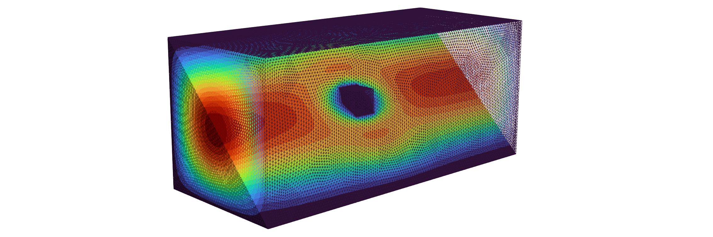

# MinFEMFlow.jl
*A minimalistic Stokes flow solver for MinFEM.jl*

* The purpose of this package is to provide an easy and minimalistic solver for Stokes flow based on first order finite elements.

* This code imports meshes created via GMSH and outputs VTK format for Paraview.

* Problems are in general considered to be two-dimensional.
While 3D is technically supported, the performance is not suitable for reasonable problems.

For some example problems and usage of the package, please visit the [examples](examples.md) page.

There is also a short documentation of every type and function provided in the [library](library.md).
